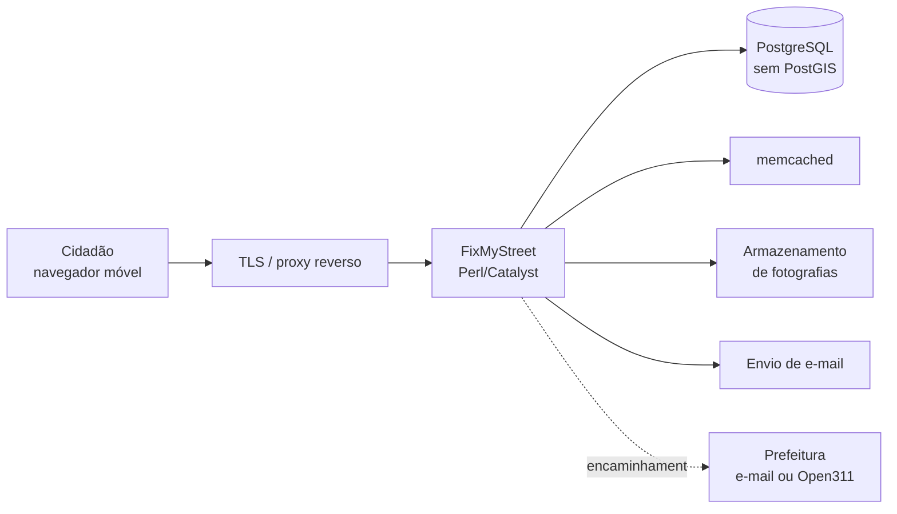

# Plano de Ação — FixMyStreet Brasil

> **Piloto municipal — Catanduva/SP**

---

## ⚠️ Natureza deste documento

Este documento é um **rascunho proposto**, não o registro de decisões já tomadas.

O prompt de planejamento original referenciava um `Plano_de_Acao_FixMyStreet_Brasil.docx`
como fonte principal. **Esse arquivo nunca foi localizado** — busca recursiva em todo o
perfil do usuário não o encontrou em nenhum formato. Este documento foi redigido para
ocupar aquele lugar.

Cada afirmação está classificada:

| Marca | Significado |
|---|---|
| ✅ **FATO** | Verificado por inspeção do código, do banco ou do ambiente em execução |
| 💡 **PROPOSTA** | Recomendação técnica; precisa de validação |
| ❓ **PENDENTE** | Decisão institucional ou de negócio; **não pode ser inferida** |

Nada marcado como ❓ foi preenchido por suposição. Onde falta informação, está dito que falta.

---

## 1. Objetivo

Disponibilizar à população de Catanduva–SP um canal digital para registrar problemas
urbanos — buracos, iluminação, lixo, sinalização — com localização no mapa, fotografia e
acompanhamento público do andamento, e encaminhá-los ao poder público de forma rastreável.

❓ **PENDENTE — perguntas que definem o projeto:**

1. Existe parceria formal com a Prefeitura de Catanduva, ou é iniciativa independente da sociedade civil?
2. Se independente, a prefeitura tem ciência? Como as ocorrências chegariam até ela?
3. Quem responde pelo projeto juridicamente? Pessoa física, associação, empresa?
4. Há orçamento? De quanto, e custeado por quem?
5. Qual o horizonte do piloto — 3 meses, 6 meses, indeterminado?

Sem as respostas 1 e 2, o projeto pode virar um catálogo público de problemas que ninguém
resolve — o que corrói a confiança da população e é pior que não existir.

---

## 2. Base técnica

✅ **FATO — o que herdamos**

| Item | Valor |
|---|---|
| Origem | `github.com/mysociety/fixmystreet` |
| Licença | **AGPL-3.0** |
| Baseline | tag `v6.0` = `691e1b8cc8476e97ebffb44b1f8eb2aeff63155c` |
| Stack | Perl 5.32.1 + Catalyst, server-rendered |
| Banco | PostgreSQL 13 — **sem PostGIS** |
| Cache | memcached |
| Front | Template Toolkit + SCSS + jQuery; **sem framework SPA** |
| Testes | 221 arquivos, 4.398 testes, todos passando |

### 2.1 Implicação da licença AGPL-3.0

✅ **FATO.** A AGPL obriga a disponibilizar o código-fonte modificado a **qualquer usuário
que interaja com o serviço pela rede** — não apenas a quem recebe o binário.

Consequências práticas:

- O código do piloto brasileiro **precisa ser público**. Já está: o fork é público.
- Um eventual contrato com a prefeitura não pode prometer exclusividade sobre o código.
- Fornecedor que venha a customizar o sistema está sujeito à mesma obrigação.

❓ **PENDENTE:** a prefeitura ou os patrocinadores foram informados dessa condição?

### 2.2 Ausência de PostGIS

✅ **FATO.** Contrariando a suposição comum, o FixMyStreet **não usa PostGIS**. Verificado
em três frentes: nenhuma extensão além de `plpgsql` instalada; zero menções a
`postgis`/`geometry`/`geography` em `db/schema.sql`; a tabela `problem` guarda
`latitude`/`longitude` como `double precision`, com índice
`problem_radians_latitude_longitude_idx`.

**Isso barateia o piloto:** qualquer PostgreSQL gerenciado serve, sem exigir extensão
geoespacial — o que amplia muito as opções de provedor.

### 2.3 O que já existe e não precisa ser construído

✅ **FATO.** Levantamento feito para evitar retrabalho:

| Recurso | Situação |
|---|---|
| Tradução pt-BR | `locale/pt_BR.UTF-8/` **já existe** — é revisão, não trabalho do zero |
| Open311 | Completo: `Open311.pm`, `SendReport/Open311.pm`, ingestão de atualizações e catálogo de serviços |
| Envio por e-mail | `SendReport/Email.pm` |
| Compartilhamento social | Open Graph implementado, com imagem dedicada 1200×630 (`photo.url_og`) |
| Moderação | `Moderate.pm` + tabela `moderation_original_data` com **trilha de auditoria** |
| Acessibilidade | 35 templates com atributos ARIA; mapa com versão `noscript` |
| Customização visual | Mecanismo de **cobrand** — 47 exemplos no repositório |

Ou seja: boa parte do que um plano ingênuo listaria como "a desenvolver" já está pronto.
O esforço real está em **adaptar, configurar e validar**, não em construir.

---

## 3. Problemas técnicos identificados que afetam o Brasil

Estes não são hipóteses — foram encontrados executando o sistema.

### 3.1 Chamada bloqueante a serviço no Reino Unido

✅ **FATO.** Toda página de mapa faz uma requisição HTTP **síncrona** a
`https://gaze.mysociety.org/gaze`, chamando `get_radius_containing_population` para
definir o raio de "ocorrências próximas". Chamado em `Map/Base.pm:58`, `Map.pm:129` e
`Rss.pm:126`.

Medição feita daqui: **1,0s a 2,0s por chamada, respondendo HTTP 400.** Ou seja, pagamos
~2s de latência por um serviço que provavelmente nem tem dado populacional para o Brasil.

Efeito medido nas páginas (já descontado o debug toolbar):

| Rota | Tempo |
|---|---|
| `/` | 0,033s |
| `/reports` | 0,019s |
| `/report/<id>` | **1,990s** |
| `/around` | **1,989s** |

💡 **PROPOSTA:** eliminar a chamada fixando um raio padrão. O próprio código mostra o
caminho — `Problem.pm:1289` traz o comentário *"prevents the call to Gaze which isn't
necessary"*, passando `distance` explicitamente. Tarefa **INF-004**.

### 3.2 `problem.postcode` é obrigatório

✅ **FATO.** A coluna é `NOT NULL`, modelada em torno do código postal britânico.
Descoberto porque a primeira tentativa de cadastro quebrou com violação de constraint.

❓ **PENDENTE — decisão de produto:** o CEP passa a ser obrigatório no Brasil? Muita gente
não sabe o CEP da rua onde está. Opções:

- Exigir CEP → atrito alto, abandono provável no cadastro
- Preencher automaticamente por geocodificação reversa a partir do pino no mapa
- Gravar um valor sintético quando ausente

💡 **PROPOSTA:** preenchimento automático pela coordenada, com o campo visível e editável.
Tarefa **UX-003**.

### 3.3 Performance em conexão lenta

✅ **FATO.** As páginas são enxutas — 7 KB a 29 KB de HTML. Bom ponto de partida para
celular em rede móvel.

❌ **NÃO EXISTE** documentação de performance ou escala no repositório. Metas de latência,
orçamento de payload e comportamento em 3G precisam ser definidos por nós.

💡 **PROPOSTA — metas do piloto**, a validar:

| Métrica | Meta |
|---|---|
| Página de mapa (após corrigir 3.1) | < 800 ms |
| Payload de HTML | < 40 KB |
| Cadastro completo de ocorrência | < 3 min |

---

## 4. Arquitetura de implantação

💡 **PROPOSTA.** Monólito modular em containers, sem Kubernetes e sem microserviços.

❓ **PENDENTE — nenhuma destas pode ser decidida por mim:**

1. Provedor de cloud
2. Domínio do serviço
3. Provedor de envio de e-mail — crítico: e-mail de confirmação que cai em spam mata o cadastro
4. Onde as fotografias ficam — disco da instância ou armazenamento de objetos

💡 **PROPOSTA sobre fotografias:** armazenamento de objetos desde o início. Fotografia em
disco de instância impede recriar o servidor sem perder dados, e é justamente o ativo mais
sensível do sistema.

---

## 5. LGPD

⚠️ Esta seção **não substitui parecer jurídico**.

✅ **FATO — dados pessoais que o sistema coleta:** nome, e-mail, telefone (opcional),
endereço IP, coordenadas do local reportado e fotografias.

💡 **PROPOSTA — base legal e tratamento:**

| Dado | Finalidade | Visibilidade |
|---|---|---|
| Nome | Identificar autor | Pública **apenas se o cidadão optar** (`may_show_name`) |
| E-mail | Confirmar cadastro e notificar | **Nunca público** |
| Telefone | Contato do órgão | **Nunca público** |
| IP | Antiabuso | **Nunca público**, retenção curta |
| Coordenada | Localizar o problema | Pública |
| Fotografia | Evidenciar o problema | Pública **após moderação** |

❓ **PENDENTE:**

1. Quem é o **controlador** dos dados — o projeto ou a prefeitura? Se ambos, há
   controladoria conjunta e isso precisa de instrumento formal.
2. Quem exerce o papel de **encarregado (DPO)**?
3. Prazo de retenção de ocorrência resolvida — 1 ano? 5 anos? Indefinido?
4. Como se atende pedido de exclusão sem apagar o histórico público de um problema real?

💡 **PROPOSTA para a questão 4:** anonimizar o autor preservando a ocorrência. O problema
urbano é interesse público; a identidade de quem reportou, não.

**Tarefas:** LGPD-001 a LGPD-006 (seção 10).

---

## 6. Segurança

💡 **PROPOSTA — requisitos de lançamento, não melhorias posteriores:**

| Controle | Providência |
|---|---|
| HTTPS obrigatório | Certificado válido, redirecionamento, HSTS |
| Segredos | Fora do Git — `conf/general.yml` já é ignorado (✅ verificado) |
| Backup | Diário, **com teste real de restauração** |
| Atualizações | Acompanhar correções do upstream |
| Antiabuso | Limite de cadastros por IP e por e-mail |
| Acesso administrativo | Senha forte e 2FA onde houver suporte |

✅ **FATO.** Backup sem restauração testada não é backup. O plano exige **executar** uma
restauração completa antes do lançamento — tarefa **SEC-005**.

---

## 7. Moderação

✅ **FATO.** O FixMyStreet já traz `Moderate.pm` e a tabela `moderation_original_data`,
que preserva o conteúdo anterior a cada intervenção — **trilha de auditoria pronta**.

💡 **PROPOSTA — o que precisa ser criado é a política, não o software.**

Fotografia é o maior risco. Uma foto de buraco pode conter, sem intenção:

- rosto de pessoa identificável
- placa de veículo
- interior de residência
- pessoa em situação de rua

💡 **PROPOSTA:** fotografia **não aparece publicamente antes de aprovação humana** durante
todo o piloto. Automatizar depois, com volume conhecido.

❓ **PENDENTE:**

1. Quem modera? Nome e disponibilidade real.
2. Prazo máximo entre envio e publicação — 24h? 48h?
3. Como o cidadão contesta uma remoção?
4. O que fazer com denúncia de crime, que exige encaminhamento a outra autoridade?

⚠️ **Risco operacional.** Moderação manual é o gargalo mais provável do piloto. Se ninguém
tiver tempo garantido para isso, a fila cresce e o serviço perde credibilidade. Melhor
**limitar a área de cobertura** do que aceitar volume que não se consegue moderar.

---

## 8. Redes sociais

✅ **FATO.** Open Graph já implementado: `og:title` e `og:image` com imagem dedicada de
1200×630 (`photo.url_og`). Compartilhamento funciona sem desenvolvimento adicional.

💡 **PROPOSTA — regras de publicação:**

- Divulgar **estatísticas agregadas**, não ocorrências individuais com foto
- Nunca publicar endereço residencial preciso
- Nunca publicar imagem com rosto ou placa legível
- Não expor nome de cidadão, mesmo que ele tenha autorizado exibição no site — autorizar
  aparecer no site não é autorizar virar publicação

❓ **PENDENTE:** quais canais? Quem administra? Há alguém responsável por responder
comentários e mensagens?

⚠️ Rede social sem quem responda gera expectativa de atendimento que não existe.

---

## 9. Encaminhamento à prefeitura

✅ **FATO.** O FixMyStreet oferece vários métodos de envio: `Email.pm`, `Open311.pm`,
`Noop.pm`, `Refused.pm`, `Triage.pm`. A escolha é por órgão (`body.send_method`).

💡 **PROPOSTA — evolução em três estágios:**

| Estágio | Método | Quando |
|---|---|---|
| 1 | E-mail para endereço institucional | Piloto inicial |
| 2 | E-mail + protocolo manual realimentado | Piloto maduro |
| 3 | **Open311** | Se a prefeitura tiver ou adotar API |

Começar por e-mail é deliberado: não exige nada da prefeitura além de uma caixa postal.

❓ **PENDENTE — bloqueia o encaminhamento real:**

1. Qual endereço de e-mail recebe as ocorrências?
2. Existe sistema de protocolo ou ouvidoria em uso? Qual?
3. Ele expõe API? O Open311 é viável?
4. Quem, na prefeitura, atualiza o status de volta?
5. Qual o prazo de atendimento acordado, se houver?

⚠️ **Sem a resposta 4, o ciclo não fecha.** O cidadão registra, o problema é encaminhado, e
o status nunca muda. É a principal causa de fracasso deste tipo de plataforma.

### 9.1 Matriz de encaminhamento

❓ **PENDENTE — precisa ser construída com a prefeitura.** Formato sugerido:

| Categoria | Órgão responsável | Contato | Prazo |
|---|---|---|---|
| Buraco na via | *(a definir)* | *(a definir)* | *(a definir)* |
| Iluminação pública | *(a definir)* | *(a definir)* | *(a definir)* |
| Lixo acumulado | *(a definir)* | *(a definir)* | *(a definir)* |

💡 **PROPOSTA:** começar com **5 a 8 categorias**. Muitas categorias confundem o cidadão e
aumentam o erro de encaminhamento.

---

## 10. Roadmap e backlog

Identificadores conforme o padrão do prompt original.

### Fase 1 — Descoberta e governança

| ID | Tarefa | Situação | Resp. |
|---|---|---|---|
| RD-001 | Redigir e validar este plano de ação | Em curso | PO |
| RD-002 | Definir natureza jurídica e responsável pelo projeto | ❓ Bloqueada | PO |
| RD-003 | Formalizar (ou descartar) parceria com a prefeitura | ❓ Bloqueada | PO |
| RD-004 | Construir a matriz de encaminhamento | ❓ Bloqueada por RD-003 | PO |
| RD-005 | Definir categorias iniciais (5 a 8) | ❓ Bloqueada por RD-004 | PO |
| RD-006 | Definir área geográfica do piloto | ❓ Bloqueada | PO |
| RD-007 | Nomear moderador e definir turnos | ❓ Bloqueada | PO |

### Fase 2 — Fundação técnica

| ID | Tarefa | Situação | Resp. |
|---|---|---|---|
| INF-001 | Escolher provedor de cloud | ❓ Bloqueada | DevOps |
| INF-002 | Provisionar ambiente de homologação | Não iniciada | DevOps |
| INF-003 | Configurar domínio e HTTPS | ❓ Bloqueada | DevOps |
| **INF-004** | **Eliminar chamada bloqueante ao Gaze** | **Pronta para execução** | Backend |
| INF-005 | Configurar envio de e-mail com SPF/DKIM/DMARC | ❓ Bloqueada | DevOps |
| INF-006 | Armazenamento de objetos para fotografias | ❓ Bloqueada | DevOps |
| INF-007 | Backup automatizado | Não iniciada | DevOps |
| INF-008 | Observabilidade e alerta de indisponibilidade | Não iniciada | DevOps |

### Fase 3 — Experiência do usuário brasileiro

| ID | Tarefa | Situação | Resp. |
|---|---|---|---|
| **UX-001** | **Revisar tradução pt-BR** — já existe, não é do zero | **Pronta** | Frontend |
| UX-002 | Criar cobrand `catanduva` | Pronta | Frontend |
| **UX-003** | **Resolver o CEP obrigatório** | ❓ Depende de decisão | Backend |
| UX-004 | Adequar vocabulário (bairro, CEP, protocolo, prefeitura) | Pronta | Frontend |
| UX-005 | Validar fluxo em celular e rede lenta | Não iniciada | QA |
| UX-006 | Auditoria de acessibilidade (WCAG/eMAG) | Não iniciada | Frontend |
| UX-007 | Spec Cypress do cobrand e reativação no CI | Não iniciada | QA |

### Fase 4 — LGPD, segurança e moderação

| ID | Tarefa | Situação | Resp. |
|---|---|---|---|
| LGPD-001 | Redigir política de privacidade | ❓ Bloqueada por RD-002 | Jurídico |
| LGPD-002 | Definir controlador e encarregado | ❓ Bloqueada | Jurídico |
| LGPD-003 | Definir prazos de retenção | ❓ Bloqueada | Jurídico |
| LGPD-004 | Implementar anonimização em pedido de exclusão | Não iniciada | Backend |
| LGPD-005 | Revisar campos públicos versus privados | Pronta | Backend |
| LGPD-006 | Registrar operações de tratamento | ❓ Bloqueada | Jurídico |
| SEC-001 | HTTPS obrigatório e HSTS | Depende de INF-003 | DevOps |
| SEC-002 | Antiabuso por IP e e-mail | Não iniciada | Backend |
| SEC-003 | 2FA nas contas administrativas | Não iniciada | DevOps |
| SEC-004 | Revisar dependências e correções do upstream | Pronta | DevOps |
| **SEC-005** | **Testar restauração real do backup** | Depende de INF-007 | DevOps |
| MOD-001 | Definir política de moderação | ❓ Bloqueada por RD-007 | PO |
| MOD-002 | Configurar aprovação prévia de fotografia | Pronta | Backend |
| MOD-003 | Treinar moderador | ❓ Bloqueada | PO |

### Fase 5 — Transparência e redes sociais

| ID | Tarefa | Situação | Resp. |
|---|---|---|---|
| SOC-001 | Validar Open Graph com o cobrand | Pronta | Frontend |
| SOC-002 | Definir regras de publicação | ❓ Bloqueada | PO |
| SOC-003 | Painel público de estatísticas agregadas | Não iniciada | Backend |

### Fase 6 — Encaminhamento e integração

| ID | Tarefa | Situação | Resp. |
|---|---|---|---|
| INT-001 | Cadastrar órgão e categorias | ❓ Bloqueada por RD-004 | Backend |
| INT-002 | Configurar envio por e-mail | ❓ Bloqueada por RD-003 | Backend |
| INT-003 | Definir fluxo de atualização de status | ❓ Bloqueada | PO |
| INT-004 | Avaliar viabilidade de Open311 | ❓ Bloqueada | Líder técnico |

### Fase 7 — Qualidade e piloto

| ID | Tarefa | Situação | Resp. |
|---|---|---|---|
| QA-001 | Plano de testes de aceitação | Não iniciada | QA |
| QA-002 | Teste com usuários reais não técnicos | Não iniciada | QA |
| QA-003 | Teste de carga compatível com a população | Não iniciada | QA |
| PIL-001 | Definir métricas e instrumentação | Não iniciada | PO |
| PIL-002 | Lançamento restrito | ❓ Bloqueada | PO |
| PIL-003 | Acompanhamento e ajuste | Não iniciada | PO |

💡 **PROPOSTA — métricas do piloto:**

| Métrica | Por quê |
|---|---|
| Taxa de conclusão do cadastro | Mede atrito da interface |
| Tempo médio de cadastro | Meta: menos de 3 min |
| Percentual encaminhado corretamente | Valida a matriz |
| Percentual que muda de status | **A mais importante** — mede se o ciclo fecha |
| Tempo até resolução | Mede a prefeitura, não o sistema |
| Ocorrências duplicadas | Mede necessidade de deduplicação |
| Taxa de abuso | Dimensiona a moderação |

---

## 11. Releases

| Release | Objetivo | Situação |
|---|---|---|
| **R0** | Repositório, ambiente local, GitFlow e CI | ✅ **Concluída** |
| R0.1 | Correções técnicas independentes de decisão | **Pode começar já** |
| R1 | MVP interno em homologação | ❓ Bloqueada por INF-001 |
| R2 | Piloto controlado, público restrito | ❓ Bloqueada por RD-003 |
| R3 | Lançamento limitado | ❓ Bloqueada por R2 |
| R4 | Evolução pós-piloto | — |

**R0.1 é executável imediatamente** e não depende de nenhuma decisão pendente:
INF-004, UX-001, UX-002 e UX-004.

---

## 12. Riscos

| Risco | Prob. | Impacto | Mitigação |
|---|---|---|---|
| **Prefeitura não participa** | Média | **Crítico** | Definir antes do lançamento se o piloto faz sentido sem ela |
| **Status nunca é atualizado** | **Alta** | **Crítico** | Exigir responsável nomeado (INT-003) antes de abrir ao público |
| Moderação não dá conta do volume | Alta | Alto | Limitar área geográfica; moderação prévia obrigatória |
| Exposição indevida em fotografia | Média | **Crítico** | Aprovação humana durante todo o piloto |
| E-mail de confirmação cai em spam | Média | Alto | SPF/DKIM/DMARC (INF-005) |
| Latência do Gaze | **Confirmado** | Médio | INF-004 |
| Divergência com o upstream | Média | Médio | Customização apenas em cobrand |
| Custo de cloud acima do previsto | Média | Médio | Alerta de orçamento |
| Baixa adesão da população | Média | Alto | Divulgação combinada com resolução real |

⚠️ Os dois primeiros riscos são **existenciais**. Se o ciclo não fecha, a plataforma vira
vitrine de problemas não resolvidos e queima a confiança da população.

---

## 13. Decisões pendentes — consolidado

Nenhuma delas pode ser tomada por análise técnica.

| # | Decisão | Bloqueia |
|---|---|---|
| 1 | Parceria com a prefeitura | RD-003, RD-004, INT-*, R2 |
| 2 | Responsável jurídico pelo projeto | RD-002, LGPD-* |
| 3 | Quem atualiza o status na prefeitura | INT-003 — **fecho do ciclo** |
| 4 | Quem modera e com que disponibilidade | RD-007, MOD-* |
| 5 | Provedor de cloud e orçamento | INF-001, R1 |
| 6 | Domínio do serviço | INF-003 |
| 7 | Categorias iniciais | RD-005, INT-001 |
| 8 | Área geográfica do piloto | RD-006 |
| 9 | Prazos de retenção de dados | LGPD-003 |
| 10 | Papel do CEP no cadastro | UX-003 |

---

## 14. Próxima ação recomendada

**Executar a R0.1**, que não depende de nenhuma decisão pendente:

1. **INF-004** — eliminar a chamada ao Gaze (ganho medido: ~2s por página de mapa)
2. **UX-002** — criar o cobrand `catanduva`
3. **UX-001** — revisar a tradução pt-BR existente
4. **UX-004** — adequar vocabulário ao contexto municipal brasileiro

Em paralelo, responder às decisões 1, 2 e 3 da seção 13 — são elas que determinam se o
piloto é viável.

---

## Referências

- [`BASELINE.md`](BASELINE.md) — origem, tag e submódulos
- [`AMBIENTE_LOCAL.md`](AMBIENTE_LOCAL.md) — instalação do zero
- [`FLUXO_TRABALHO.md`](FLUXO_TRABALHO.md) — GitFlow e integração contínua
