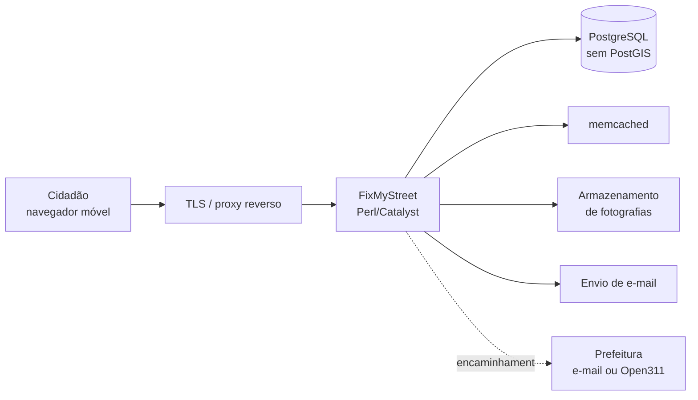

# Plano de Ação — FixMyStreet Brasil

> **Piloto municipal — Catanduva/SP**

---

## ⚠️ Natureza deste documento

Este documento é um **rascunho proposto**, não o registro de decisões já tomadas.

O prompt de planejamento original referenciava um `Plano_de_Acao_FixMyStreet_Brasil.docx`
como fonte principal. **Esse arquivo nunca foi localizado** — busca recursiva em todo o
perfil do usuário não o encontrou em nenhum formato. Este documento foi redigido para
ocupar aquele lugar.

Cada afirmação está classificada:

| Marca | Significado |
|---|---|
| ✅ **FATO** | Verificado por inspeção do código, do banco ou do ambiente em execução |
| ✔️ **DECIDIDO** | Decisão tomada pelo responsável pelo projeto em **09/09/2026** |
| 💡 **PROPOSTA** | Recomendação técnica; precisa de validação |
| ⏳ **ADIADO** | Depende de conversa com a prefeitura que ainda não aconteceu; **fora do escopo do MVP** |
| ❓ **PENDENTE** | Decisão institucional ou de negócio; **não pode ser inferida** |

Nada marcado como ❓ foi preenchido por suposição. Onde falta informação, está dito que falta.

**Rodada de decisões de 09/09/2026:** as 10 pendências originais foram respondidas pelo
responsável. Seis viraram ✔️ DECIDIDO, três viraram ⏳ ADIADO por dependerem da prefeitura,
e uma continua ❓ PENDENTE por não ter sido efetivamente respondida (seção 4).

---

## 1. Objetivo

Disponibilizar à população de Catanduva–SP um canal digital para registrar problemas
urbanos — buracos, iluminação, lixo, sinalização — com localização no mapa, fotografia e
acompanhamento público do andamento.

✔️ **DECIDIDO — natureza e horizonte do projeto:**

| Pergunta | Decisão |
|---|---|
| Parceria com a prefeitura | **Não existe.** Iniciativa independente da sociedade civil |
| Como a prefeitura entra | Só depois: construir o MVP e **apresentá-lo** a ela |
| Responsável jurídico | **Pessoa física** |
| Orçamento | Ainda sem valores; custo de cloud a levantar |
| Horizonte inicial | **3 meses** |

O projeto nasce como instrumento de **fiscalização da qualidade do serviço público** por
parte da sociedade civil, com a hipótese assumida de que a prefeitura pode não se
interessar.

### 1.1 Consequência sobre o escopo — leia antes de planejar qualquer coisa

Esta decisão é a mais estruturante do documento, e muda o plano em três pontos:

**1. A fase de encaminhamento sai do escopo inicial.** Sem parceria não há caixa postal
institucional, não há órgão cadastrado e não há quem atualize o status. Toda a Fase 6
(`INT-001` a `INT-004`) passa de ❓ *bloqueada* para ⏳ **adiada por decisão** — não é um
impedimento a resolver, é escopo deliberadamente fora do MVP.

**2. O MVP é uma peça de demonstração, não um lançamento público.** É essa distinção que
neutraliza o risco existencial descrito na seção 12. O documento original alertava: *"o
projeto pode virar um catálogo público de problemas que ninguém resolve"*. Isso continua
verdadeiro — **mas só se o serviço for aberto à população antes de existir alguém que
responda.** Como o MVP se destina a ser apresentado à prefeitura, e não usado pelo
cidadão, o risco fica adiado junto com a fase.

⚠️ **A regra que decorre disso:** o serviço **não abre ao público** enquanto não houver
resposta da prefeitura ou uma decisão explícita de operar sem ela. Se em algum momento se
optar por abrir mesmo sem parceria, a interface precisa dizer com todas as letras que o
registro **não** é um protocolo oficial e que ninguém se comprometeu a resolvê-lo.
Prometer encaminhamento que não existe é pior do que não ter o serviço.

**3. Pessoa física como responsável tem efeito na LGPD.** O controlador dos dados passa a
ser uma pessoa natural identificada, que responde pessoalmente pelo tratamento — ver
seção 5.

---

## 2. Base técnica

✅ **FATO — o que herdamos**

| Item | Valor |
|---|---|
| Origem | `github.com/mysociety/fixmystreet` |
| Licença | **AGPL-3.0** |
| Baseline | tag `v6.0` = `691e1b8cc8476e97ebffb44b1f8eb2aeff63155c` |
| Stack | Perl 5.32.1 + Catalyst, server-rendered |
| Banco | PostgreSQL 13 — **sem PostGIS** |
| Cache | memcached |
| Front | Template Toolkit + SCSS + jQuery; **sem framework SPA** |
| Testes | 221 arquivos, 4.398 testes, todos passando |

### 2.1 Implicação da licença AGPL-3.0

✅ **FATO.** A AGPL obriga a disponibilizar o código-fonte modificado a **qualquer usuário
que interaja com o serviço pela rede** — não apenas a quem recebe o binário.

Consequências práticas:

- O código do piloto brasileiro **precisa ser público**. Já está: o fork é público.
- Um eventual contrato com a prefeitura não pode prometer exclusividade sobre o código.
- Fornecedor que venha a customizar o sistema está sujeito à mesma obrigação.

✔️ **DECIDIDO:** a condição da AGPL será declarada explicitamente nas conversas com a
prefeitura. Como ainda não há patrocinador nem contrato, não existe compromisso anterior
a corrigir.

💡 **PROPOSTA:** levar isso por escrito, não de viva-voz. Um parágrafo no material de
apresentação evita a descoberta tardia de que o código não pode ser exclusivo — que é
exatamente o tipo de surpresa que derruba negociação já avançada.

### 2.2 Ausência de PostGIS

✅ **FATO.** Contrariando a suposição comum, o FixMyStreet **não usa PostGIS**. Verificado
em três frentes: nenhuma extensão além de `plpgsql` instalada; zero menções a
`postgis`/`geometry`/`geography` em `db/schema.sql`; a tabela `problem` guarda
`latitude`/`longitude` como `double precision`, com índice
`problem_radians_latitude_longitude_idx`.

**Isso barateia o piloto:** qualquer PostgreSQL gerenciado serve, sem exigir extensão
geoespacial — o que amplia muito as opções de provedor.

### 2.3 O que já existe e não precisa ser construído

✅ **FATO.** Levantamento feito para evitar retrabalho:

| Recurso | Situação |
|---|---|
| Tradução pt-BR | `locale/pt_BR.UTF-8/` **já existe** — é revisão, não trabalho do zero |
| Open311 | Completo: `Open311.pm`, `SendReport/Open311.pm`, ingestão de atualizações e catálogo de serviços |
| Envio por e-mail | `SendReport/Email.pm` |
| Compartilhamento social | Open Graph implementado, com imagem dedicada 1200×630 (`photo.url_og`) |
| Moderação | `Moderate.pm` + tabela `moderation_original_data` com **trilha de auditoria** |
| Acessibilidade | 35 templates com atributos ARIA; mapa com versão `noscript` |
| Customização visual | Mecanismo de **cobrand** — 47 exemplos no repositório |

Ou seja: boa parte do que um plano ingênuo listaria como "a desenvolver" já está pronto.
O esforço real está em **adaptar, configurar e validar**, não em construir.

---

## 3. Problemas técnicos identificados que afetam o Brasil

Estes não são hipóteses — foram encontrados executando o sistema.

### 3.1 Chamada bloqueante a serviço no Reino Unido

✅ **FATO.** Toda página de mapa faz uma requisição HTTP **síncrona** a
`https://gaze.mysociety.org/gaze`, chamando `get_radius_containing_population` para
definir o raio de "ocorrências próximas". Chamado em `Map/Base.pm:58`, `Map.pm:129` e
`Rss.pm:126`.

Medição feita daqui: **1,0s a 2,0s por chamada, respondendo HTTP 400.** Ou seja, pagamos
~2s de latência por um serviço que provavelmente nem tem dado populacional para o Brasil.

Efeito medido nas páginas (já descontado o debug toolbar):

| Rota | Tempo |
|---|---|
| `/` | 0,033s |
| `/reports` | 0,019s |
| `/report/<id>` | **1,990s** |
| `/around` | **1,989s** |

💡 **PROPOSTA:** eliminar a chamada fixando um raio padrão. O próprio código mostra o
caminho — `Problem.pm:1289` traz o comentário *"prevents the call to Gaze which isn't
necessary"*, passando `distance` explicitamente. Tarefa **INF-004**.

### 3.2 `problem.postcode` é obrigatório

✅ **FATO.** A coluna é `NOT NULL`, modelada em torno do código postal britânico.
Descoberto porque a primeira tentativa de cadastro quebrou com violação de constraint.

✔️ **DECIDIDO — preenchimento automático.** Das três opções consideradas (exigir o CEP do
cidadão, derivá-lo da coordenada, ou gravar valor sintético), fica a **geocodificação
reversa a partir do pino no mapa**, com o campo visível e editável.

É a escolha que preserva o dado sem transferir ao cidadão a obrigação de saber o CEP da
rua onde está — a causa provável de abandono no meio do cadastro.

**Consequência de implementação:** `UX-003` saiu de bloqueada e foi entregue. Os dois
detalhes técnicos que faltavam ficaram assim:

- ✔️ **Serviço de geocodificação reversa: OSM/Nominatim**, que já é o padrão do
  `get_reverse_geocoder`. Cobre o Brasil, devolve `address.postcode`, não exige chave de
  API nem faturamento — o que importa enquanto `INF-001` não tem orçamento. Bing e Google
  continuam disponíveis trocando uma linha de configuração.
- ✔️ **Sem CEP, grava string vazia.** Satisfaz o `NOT NULL` sem inventar um número que
  seguiria a ocorrência até quem um dia for recebê-la.

**Achado durante a implementação:** o problema era maior que a lacuna. `problem.postcode`
recebia `$params{pc}`, o texto livre da caixa de busca — que em pt-BR convida a digitar
"um CEP próximo, **ou o nome da rua e o bairro**". A coluna guardava "Rua São Paulo,
Centro" com a mesma naturalidade com que guardava um CEP. Agora só entra ali o que casa
com o formato de CEP.

### 3.3 Performance em conexão lenta

✅ **FATO.** As páginas são enxutas — 7 KB a 29 KB de HTML. Bom ponto de partida para
celular em rede móvel.

❌ **NÃO EXISTE** documentação de performance ou escala no repositório. Metas de latência,
orçamento de payload e comportamento em 3G precisam ser definidos por nós.

💡 **PROPOSTA — metas do piloto**, a validar:

| Métrica | Meta |
|---|---|
| Página de mapa (após corrigir 3.1) | < 800 ms |
| Payload de HTML | < 40 KB |
| Cadastro completo de ocorrência | < 3 min |

---

## 4. Arquitetura de implantação

💡 **PROPOSTA.** Monólito modular em containers, sem Kubernetes e sem microserviços.

**Situação das quatro decisões de infraestrutura:**

| # | Item | Estado |
|---|---|---|
| 1 | Provedor de cloud | ❓ **PENDENTE** — ver abaixo |
| 2 | Domínio do serviço | ✔️ **DECIDIDO** — domínio próprio, derivado do nome do projeto |
| 3 | Provedor de envio de e-mail | ❓ **PENDENTE** — ver abaixo |
| 4 | Armazenamento de fotografias | ✔️ **DECIDIDO** — armazenamento de objetos |

❓ **Os itens 1 e 3 continuam abertos.** As perguntas eram "qual provedor", e a resposta
registrada foi "sim" — o que confirma que haverá um provedor, mas não diz qual. Como não
dá para inferir, ficam pendentes, e a seção abaixo transforma a escolha numa tarefa de
levantamento em vez de um palpite.

✔️ **Fotografias — armazenamento de objetos, decidido.** Confirma a recomendação: foto em
disco de instância impede recriar o servidor sem perder dados, e é justamente o ativo mais
sensível do sistema. A ressalva registrada — *"ou um serviço específico caso seja mais
barato"* — é compatível: qualquer serviço compatível com a API S3 serve, e a escolha entra
no mesmo levantamento de custo.

### 4.1 Levantamento de custo — tarefa INF-001 redefinida

Como não há orçamento definido, a decisão de cloud não deve sair de preferência pessoal,
e sim de uma comparação de custo real. `INF-001` deixa de ser "escolher provedor" e passa
a ser **"levantar o custo mensal de três configurações e escolher com número na mão"**.

✅ **FATO que simplifica o levantamento:** o repositório já traz um `docker-compose.yml`
de produção com imagem pronta (`fixmystreet/fixmystreet:stable`) e nginx. Some-se a
ausência de PostGIS (seção 2.2), e o resultado é que **uma única instância pequena roda a
pilha inteira** — não é preciso banco gerenciado no MVP.

💡 **PROPOSTA — o que comparar:**

| Componente | Alternativas a cotar |
|---|---|
| Instância | VPS de 2 vCPU / 4 GB rodando o compose completo |
| Banco | PostgreSQL no próprio compose (MVP) *vs.* gerenciado (depois) |
| Objetos | Serviço compatível com S3 — cotar por GB armazenado e por tráfego de saída |
| E-mail | Serviço transacional com faixa gratuita suficiente para o piloto |
| Domínio | Registro `.br` ou `.org`, custo anual |

⚠️ **Verificar arquitetura antes de fechar a instância.** As opções mais baratas do mercado
costumam ser ARM64. A máquina de desenvolvimento é AMD64, então esse risco nunca apareceu
até agora — mas numa instância ARM ele volta, e a imagem oficial precisa ter build `arm64`.
**Confirmar antes de contratar**, não depois.

💡 **PROPOSTA sobre e-mail (item 3):** o critério de escolha não é preço, é **entregabilidade**.
Um e-mail de confirmação que cai em spam impede o cadastro de ser concluído — o serviço
fica inutilizável mesmo funcionando. O que importa: domínio próprio autenticado com
SPF, DKIM e DMARC (`INF-005`), e reputação de IP do provedor. Enviar direto do servidor da
aplicação, sem serviço transacional, é a receita mais rápida para cair em spam.

---

## 5. LGPD

⚠️ Esta seção **não substitui parecer jurídico**.

✅ **FATO — dados pessoais que o sistema coleta:** nome, e-mail, telefone (opcional),
endereço IP, coordenadas do local reportado e fotografias.

💡 **PROPOSTA — base legal e tratamento:**

| Dado | Finalidade | Visibilidade |
|---|---|---|
| Nome | Identificar autor | Pública **apenas se o cidadão optar** (`may_show_name`) |
| E-mail | Confirmar cadastro e notificar | **Nunca público** |
| Telefone | Contato do órgão | **Nunca público** |
| IP | Antiabuso | **Nunca público**, retenção curta |
| Coordenada | Localizar o problema | Pública |
| Fotografia | Evidenciar o problema | Pública **após moderação** |

**Situação das quatro decisões de LGPD:**

| # | Questão | Decisão |
|---|---|---|
| 1 | Controlador | ✔️ **O projeto, isoladamente.** A prefeitura fica fora — não há controladoria conjunta |
| 2 | Encarregado (DPO) | ❓ **PENDENTE** — a definir |
| 3 | Retenção de ocorrência resolvida | ✔️ **5 anos** |
| 4 | Exclusão sem apagar histórico | ✔️ **Anonimizar o autor, preservar a ocorrência** |

✔️ **Controlador — decisão com consequência pessoal.** Como o responsável jurídico é
**pessoa física** (seção 1), é essa pessoa que responde pelo tratamento perante a ANPD e
perante o titular. Não há organização atrás. Dois efeitos práticos:

- a política de privacidade precisa identificar o controlador de forma real e fornecer um
  canal de contato que funcione;
- não haver controladoria conjunta **simplifica** o piloto: dispensa o instrumento formal
  que seria exigido se a prefeitura entrasse como cocontroladora. Se a parceria vier a
  existir, essa decisão precisa ser reaberta — passa a haver duas partes tratando os
  mesmos dados.

✔️ **Retenção de 5 anos.** Prazo definido. `LGPD-003` sai de bloqueada.

✅ **IMPLEMENTADO (LGPD-007) — a rotina existe.** `bin/catanduva/expurgo-lgpd`, agendado em
`conf/crontab-catanduva`. Não bastava declarar o prazo na política e manter o dado para
sempre no banco: prazo não cumprido é pior do que prazo não declarado.

A rotina **anonimiza, não apaga** — é onde as decisões 3 e 4 se encontram: some quem
reportou, permanece o buraco na rua. O prazo mora no script, não na linha de cron, porque é
decisão registrada aqui e não parâmetro de operação.

⚠️ **Alcança apenas ocorrências resolvidas ou fechadas**, que é exatamente o escopo da
decisão 3 ("retenção de ocorrência resolvida"). Uma ocorrência que siga aberta depois de
cinco anos é problema de operação, não de retenção — e anonimizá-la calada esconderia
justamente o caso que merece atenção.

✔️ **Exclusão por anonimização.** Confirma a proposta: o problema urbano é interesse
público, a identidade de quem reportou não. Atende ao direito de eliminação sem destruir
o registro do problema.

❓ **Encarregado (DPO) — continua pendente.** Não bloqueia código, mas **bloqueia a
publicação da política de privacidade** (`LGPD-001`), que precisa nomear o canal de
atendimento ao titular. Numa operação de pessoa física, o próprio responsável pode
acumular o papel — o que a LGPD admite. O que não se admite é publicar o serviço sem
canal nenhum.

**Tarefas:** LGPD-001 a LGPD-006 (seção 10).

---

## 6. Segurança

💡 **PROPOSTA — requisitos de lançamento, não melhorias posteriores:**

| Controle | Providência |
|---|---|
| HTTPS obrigatório | Certificado válido, redirecionamento, HSTS |
| Segredos | Fora do Git — `conf/general.yml` já é ignorado (✅ verificado) |
| Backup | Diário, **com teste real de restauração** |
| Atualizações | Acompanhar correções do upstream |
| Antiabuso | Limite de cadastros por IP e por e-mail |
| Acesso administrativo | Senha forte e 2FA onde houver suporte |

✅ **FATO.** Backup sem restauração testada não é backup. O plano exige **executar** uma
restauração completa antes do lançamento — tarefa **SEC-005**.

---

## 7. Moderação

✅ **FATO.** O FixMyStreet já traz `Moderate.pm` e a tabela `moderation_original_data`,
que preserva o conteúdo anterior a cada intervenção — **trilha de auditoria pronta**.

💡 **PROPOSTA — o que precisa ser criado é a política, não o software.**

Fotografia é o maior risco. Uma foto de buraco pode conter, sem intenção:

- rosto de pessoa identificável
- placa de veículo
- interior de residência
- pessoa em situação de rua

✅ **IMPLEMENTADO (MOD-002).** Fotografia **não aparece publicamente antes de aprovação
humana**. O cobrand nega por padrão; quem pode moderar enxerga a foto (não dá para julgar
o que não se vê); e passar o relatório pela moderação marca a foto como aprovada — o
formulário de moderação já exibe a foto com caixa de manter/remover, então submetê-lo é
uma decisão sobre ela. Automatizar depois, com volume conhecido.

⚠️ **Consequência operacional a não esquecer.** Com `MOD-003` ainda pendente (ninguém
nomeado), **nenhuma foto será aprovada por conta própria**. Isso é correto e proposital,
mas significa que numa demonstração à prefeitura as fotos só aparecem se alguém da equipe,
com permissão de moderação, aprovar antes. Não é bug; é o portão fazendo seu trabalho.

✔️ **DECIDIDO — a aprovação é implícita, e isso deve ser revisitado.** Hoje aprovar é um
efeito de passar o relatório pela moderação, não um ato separado. A escolha evita construir
uma tela de aprovação para um moderador que ainda não existe.

O custo é conhecido: **um moderador que entre só para corrigir um título aprova a foto de
carona.** No volume de um MVP de demonstração isso é irrelevante. No dia em que o serviço
abrir ao público, provavelmente não é — então a troca para aprovação explícita, com campo
próprio, deve entrar junto de `MOD-003`, quando existir um moderador de verdade e a tela
dele fizer sentido.

**Situação das quatro decisões de moderação:**

| # | Questão | Decisão |
|---|---|---|
| 1 | Quem modera | ✔️ **Direção definida:** moderador humano **ou** triagem por IA. Quem, especificamente, ainda não |
| 2 | Prazo até a publicação | ⚠️ **"O mais rápido possível"** — não é um prazo; ver abaixo |
| 3 | Contestação de remoção | ✔️ Canal de atendimento **automatizado** |
| 4 | Denúncia de crime | ✔️ Canal que **redireciona à autoridade competente** |

⚠️ **"O mais rápido possível" não é operável.** Não dá para medir cumprimento, não dá para
alertar sobre atraso e não dá para dizer ao cidadão quanto tempo esperar. Enquanto não
houver um número, a fila não tem critério de saúde.

💡 **PROPOSTA — 24 horas, com uma ressalva.** É prazo defensável para publicar ao cidadão
e, no volume de um MVP de demonstração, folgado. A ressalva importa mais que o número: o
prazo deve valer **a partir do momento em que houver moderador nomeado**. Publicar "24h"
sem ninguém de plantão é assumir compromisso que ninguém vai cumprir.

💡 **PROPOSTA sobre IA na moderação.** A ideia é boa e reduz o gargalo, mas não elimina o
humano no piloto. O uso adequado é **triagem, não decisão**: a IA classifica e prioriza —
"esta foto provavelmente tem rosto", "esta provavelmente tem placa" —, e o humano aprova.
Os erros dos dois lados são assimétricos: um falso negativo publica o rosto de alguém, e
esse dano não se desfaz com uma retratação. Automatizar a aprovação final depois do
piloto, com volume conhecido, continua sendo a recomendação.

💡 **PROPOSTA sobre o canal automatizado (item 3).** Atendimento automatizado funciona
para **receber e protocolar** a contestação. A decisão sobre restabelecer o conteúdo
precisa de pessoa: é justamente o caso em que a moderação já errou uma vez.

⚠️ **Risco operacional.** Moderação manual é o gargalo mais provável do piloto. Se ninguém
tiver tempo garantido para isso, a fila cresce e o serviço perde credibilidade. Melhor
**limitar a área de cobertura** do que aceitar volume que não se consegue moderar.

✅ **Atenuado pelo escopo atual.** Como o MVP não abre ao público (seção 1.1), o volume
inicial é o que a própria equipe gerar em demonstração. O risco volta com força no dia em
que o serviço abrir — e é nesse dia que o nome do moderador precisa existir.

---

## 8. Redes sociais

✅ **FATO.** Open Graph já implementado: `og:title` e `og:image` com imagem dedicada de
1200×630 (`photo.url_og`). Compartilhamento funciona sem desenvolvimento adicional.

💡 **PROPOSTA — regras de publicação:**

- Divulgar **estatísticas agregadas**, não ocorrências individuais com foto
- Nunca publicar endereço residencial preciso
- Nunca publicar imagem com rosto ou placa legível
- Não expor nome de cidadão, mesmo que ele tenha autorizado exibição no site — autorizar
  aparecer no site não é autorizar virar publicação

⏳ **ADIADO — canais e administração.** Não há definição de quais canais, nem de quem
administra, porque depende da mesma pessoa ainda não nomeada para a moderação (seção 7).
A intenção registrada é começar automatizado e evoluir para atendimento humano nas
versões seguintes.

⚠️ Rede social sem quem responda gera expectativa de atendimento que não existe.

💡 **PROPOSTA — não abrir canal antes de existir quem responda.** O ponto acima não se
resolve automatizando: um perfil que responde com mensagem automática a quem relata um
problema real produz mais frustração do que perfil nenhum. E, diferente do site, a rede
social é **pública e indexada** — a reclamação sem resposta fica visível para todo mundo.

Como o MVP não abre ao público, **não há razão para criar os perfis agora**. A hora certa
é junto do lançamento, e a condição de entrada é ter uma pessoa nomeada. `SOC-002`
permanece adiada por isso, sem prejuízo para o restante do plano.

---

## 9. Encaminhamento à prefeitura

✅ **FATO.** O FixMyStreet oferece vários métodos de envio: `Email.pm`, `Open311.pm`,
`Noop.pm`, `Refused.pm`, `Triage.pm`. A escolha é por órgão (`body.send_method`).

💡 **PROPOSTA — evolução em três estágios:**

| Estágio | Método | Quando |
|---|---|---|
| 1 | E-mail para endereço institucional | Piloto inicial |
| 2 | E-mail + protocolo manual realimentado | Piloto maduro |
| 3 | **Open311** | Se a prefeitura tiver ou adotar API |

Começar por e-mail é deliberado: não exige nada da prefeitura além de uma caixa postal.

⏳ **ADIADO — toda esta seção sai do escopo do MVP.** As cinco perguntas dependem, sem
exceção, de uma conversa com a prefeitura que ainda não aconteceu:

| # | Pergunta | Resposta registrada |
|---|---|---|
| 1 | E-mail que recebe as ocorrências | Depende de conversa com a prefeitura |
| 2 | Sistema de protocolo ou ouvidoria em uso | A alinhar com a prefeitura |
| 3 | Open311 é viável? | **Caminho simples primeiro**, evoluir depois |
| 4 | Quem atualiza o status de volta | Depende da prefeitura |
| 5 | Prazo de atendimento | Não definido |

✔️ **Decisão que dá para tomar hoje:** confirmado o estágio 1 da tabela acima — começar
simples e evoluir. Não se investe em Open311 agora.

✅ **Isso não custa desenvolvimento.** O Open311 já vem pronto do upstream (seção 2.3).
Adiar não gera dívida técnica: no dia em que a prefeitura tiver API, é configuração de
`body.send_method`, não implementação.

⚠️ **Sem a resposta 4, o ciclo não fecha.** O cidadão registra, o problema é encaminhado, e
o status nunca muda. É a principal causa de fracasso deste tipo de plataforma.

**Como o plano lida com isso agora:** o MVP não abre ao público (seção 1.1), então não há
cidadão esperando resposta — o risco fica suspenso junto com a fase. A resposta 4 vira a
**condição de entrada do lançamento público**, não um item de backlog: enquanto não
houver alguém nomeado do lado da prefeitura, ou uma decisão consciente de operar sem
encaminhamento e dizer isso na interface, o serviço não abre.

✅ **IMPLEMENTADO (INT-005) — o que demonstrar sem a prefeitura.** O envio pode ser
desviado para uma **caixa postal do próprio projeto**, e o fluxo fica demonstrável de ponta
a ponta — cadastro, moderação, encaminhamento, e-mail chegando. A única coisa que muda no
dia da parceria é o endereço.

Configura-se por cobrand, sem endereço algum no código:

    COBRAND_FEATURES:
      demonstration_recipient:
        catanduva: 'ocorrencias@exemplo.org'

Para onde a ocorrência **teria ido** fica registrado nela. Numa demonstração é a pergunta
interessante; depois da parceria, é o registro do que o piloto fez.

⚠️ **O que isto não é.** É um desvio, não uma tranca: com a chave ausente, o envio segue os
contatos das categorias normalmente. O que impede o piloto de escrever para um órgão real é
que os contatos são nossos — o desvio só garante que isso continue verdadeiro se algum
deles for editado por engano.

❓ **Falta o endereço.** A caixa postal em si depende de `INF-005`, que espera a escolha do
provedor de e-mail (seção 13.2).

### 9.1 Matriz de encaminhamento

⏳ **ADIADO na coluna de destino** — órgão, contato e prazo só a prefeitura pode informar.

✔️ **Mas as categorias podem ser definidas agora.** Elas descrevem o problema visto pelo
cidadão, não a estrutura interna da prefeitura, e são necessárias para o MVP ter o que
demonstrar. A quarta linha abaixo foi acrescentada na rodada de decisões:

| Categoria | Órgão responsável | Contato | Prazo |
|---|---|---|---|
| Buraco na via | ⏳ | ⏳ | ⏳ |
| Iluminação pública | ⏳ | ⏳ | ⏳ |
| Lixo acumulado | ⏳ | ⏳ | ⏳ |
| **Árvore caída** | ⏳ | ⏳ | ⏳ |

💡 **PROPOSTA — completar até 5 a 8 categorias.** Faltam de uma a quatro. Candidatas
frequentes em município do porte de Catanduva: **calçada danificada**, **sinalização
(placa ou faixa) apagada ou ausente**, **entulho em via pública**, **boca de lobo
entupida**, **vazamento de água ou esgoto**.

Duas observações que valem mais que a lista: o limite de 5 a 8 existe porque categoria
demais confunde o cidadão e aumenta o erro de encaminhamento; e o **vazamento de água**
provavelmente não é da prefeitura, e sim da concessionária de saneamento — o que fará a
matriz apontar para fora do poder público municipal quando ela for construída.

`RD-005` sai de bloqueada: dá para fechar a lista sem a prefeitura.

---

## 10. Roadmap e backlog

Identificadores conforme o padrão do prompt original.

### Fase 1 — Descoberta e governança

| ID | Tarefa | Situação | Resp. |
|---|---|---|---|
| RD-001 | Redigir e validar este plano de ação | ✅ **Concluída** | PO |
| RD-002 | Definir natureza jurídica e responsável pelo projeto | ✔️ **Decidida** — pessoa física | PO |
| RD-003 | Formalizar (ou descartar) parceria com a prefeitura | ⏳ Adiada — apresentar o MVP antes | PO |
| RD-004 | Construir a matriz de encaminhamento | ⏳ Adiada por RD-003 | PO |
| RD-005 | Definir categorias iniciais (5 a 8) | **Pronta** — 4 definidas, faltam 1 a 4 | PO |
| RD-006 | Definir área geográfica do piloto | ❓ Pendente | PO |
| RD-007 | Nomear moderador e definir turnos | ❓ Pendente — direção decidida, pessoa não | PO |
| **RD-008** | **Preparar material de apresentação à prefeitura**, com a cláusula AGPL explícita | Não iniciada | PO |

### Fase 2 — Fundação técnica

| ID | Tarefa | Situação | Resp. |
|---|---|---|---|
| INF-001 | **Levantar custo de 3 configurações** e escolher a cloud com número na mão (seção 4.1) | **Pronta** — redefinida | DevOps |
| INF-002 | Provisionar ambiente de homologação | Depende de INF-001 | DevOps |
| INF-003 | Registrar domínio próprio e configurar HTTPS | **Pronta** — domínio decidido | DevOps |
| **INF-004** | **Eliminar chamada bloqueante ao Gaze** | ✅ **Concluída** — PR #8 | Backend |
| INF-005 | Configurar envio de e-mail com SPF/DKIM/DMARC | Depende de INF-003 | DevOps |
| INF-006 | Armazenamento de objetos para fotografias | **Pronta** — decidido usar objetos | DevOps |
| INF-007 | Backup automatizado | Não iniciada | DevOps |
| INF-008 | Observabilidade e alerta de indisponibilidade | Não iniciada | DevOps |

### Fase 3 — Experiência do usuário brasileiro

| ID | Tarefa | Situação | Resp. |
|---|---|---|---|
| **UX-001** | **Revisar tradução pt-BR** — já existe, não é do zero | ✅ **Concluída** — PRs #10 e #11 | Frontend |
| UX-002 | Criar cobrand `catanduva` | ✅ **Concluída** — PR #9 | Frontend |
| **UX-003** | **CEP por geocodificação reversa**, campo visível e editável | ✅ **Concluída** — PR #13 | Backend |
| UX-004 | Adequar vocabulário (bairro, CEP, protocolo, prefeitura) | ✅ **Concluída** — PR #12 | Frontend |
| UX-005 | Validar fluxo em celular e rede lenta | Não iniciada | QA |
| UX-006 | Auditoria de acessibilidade (WCAG/eMAG) | Não iniciada | Frontend |
| UX-007 | Spec Cypress do cobrand e reativação no CI | ✅ **Concluída** — PRs #14 e #15 | QA |

### Fase 4 — LGPD, segurança e moderação

| ID | Tarefa | Situação | Resp. |
|---|---|---|---|
| LGPD-001 | Redigir política de privacidade | Depende de LGPD-002 (encarregado) | Jurídico |
| LGPD-002 | Definir controlador e encarregado | **Parcial** — controlador ✔️, encarregado ❓ | Jurídico |
| LGPD-003 | Definir prazos de retenção | ✔️ **Decidida** — 5 anos | Jurídico |
| LGPD-004 | Implementar anonimização em pedido de exclusão | **Pronta** — abordagem decidida | Backend |
| LGPD-005 | Revisar campos públicos versus privados | Pronta | Backend |
| LGPD-006 | Registrar operações de tratamento | **Pronta** — controlador definido | Jurídico |
| **LGPD-007** | **Rotina de expurgo automático aos 5 anos** | ✅ **Concluída** — PR #18 | Backend |
| SEC-001 | HTTPS obrigatório e HSTS | Depende de INF-003 | DevOps |
| SEC-002 | Antiabuso por IP e e-mail | Não iniciada | Backend |
| SEC-003 | 2FA nas contas administrativas | Não iniciada | DevOps |
| SEC-004 | Revisar dependências e correções do upstream | Pronta | DevOps |
| **SEC-005** | **Testar restauração real do backup** | Depende de INF-007 | DevOps |
| MOD-001 | Definir política de moderação | **Pronta** — decisões 3 e 4 tomadas | PO |
| MOD-002 | Configurar aprovação prévia de fotografia | ✅ **Concluída** — PR #15 | Backend |
| MOD-003 | Treinar moderador | ❓ Pendente por RD-007 | PO |
| **MOD-004** | **Fixar prazo de moderação em horas** (proposta: 24h) | ❓ Pendente | PO |
| **MOD-005** | **Canal automatizado de contestação de remoção** | Pronta | Backend |
| **MOD-006** | **Fluxo de redirecionamento de denúncia de crime à autoridade** | Pronta | PO |

### Fase 5 — Transparência e redes sociais

| ID | Tarefa | Situação | Resp. |
|---|---|---|---|
| SOC-001 | Validar Open Graph com o cobrand | Pronta | Frontend |
| SOC-002 | Definir canais e quem administra | ⏳ Adiada — não criar perfis antes do lançamento | PO |
| SOC-003 | Painel público de estatísticas agregadas | Não iniciada | Backend |

### Fase 6 — Encaminhamento e integração

⏳ **Fase inteira adiada por decisão** (seção 9) — não é impedimento, é escopo fora do MVP.

| ID | Tarefa | Situação | Resp. |
|---|---|---|---|
| INT-001 | Cadastrar órgão e categorias | ⏳ Adiada por RD-004 | Backend |
| INT-002 | Configurar envio por e-mail | ⏳ Adiada por RD-003 | Backend |
| INT-003 | Definir fluxo de atualização de status | ⏳ Adiada — **condição de entrada do lançamento público** | PO |
| INT-004 | Avaliar viabilidade de Open311 | ⏳ Adiada — estágio 1 primeiro | Líder técnico |
| **INT-005** | **Caixa postal do projeto como destino de demonstração** | ✅ **Mecanismo pronto** — PR #17; falta o endereço (INF-005) | Backend |

### Fase 7 — Qualidade e piloto

| ID | Tarefa | Situação | Resp. |
|---|---|---|---|
| QA-001 | Plano de testes de aceitação | Não iniciada | QA |
| QA-002 | Teste com usuários reais não técnicos | Não iniciada | QA |
| QA-003 | Teste de carga compatível com a população | Não iniciada | QA |
| PIL-001 | Definir métricas e instrumentação | Não iniciada | PO |
| PIL-002 | Lançamento restrito | ❓ Bloqueada | PO |
| PIL-003 | Acompanhamento e ajuste | Não iniciada | PO |

💡 **PROPOSTA — métricas do piloto:**

| Métrica | Por quê |
|---|---|
| Taxa de conclusão do cadastro | Mede atrito da interface |
| Tempo médio de cadastro | Meta: menos de 3 min |
| Percentual encaminhado corretamente | Valida a matriz |
| Percentual que muda de status | **A mais importante** — mede se o ciclo fecha |
| Tempo até resolução | Mede a prefeitura, não o sistema |
| Ocorrências duplicadas | Mede necessidade de deduplicação |
| Taxa de abuso | Dimensiona a moderação |

---

## 11. Releases

A decisão de estratégia da seção 1 muda o significado de R1: ele deixa de ser "MVP interno"
e passa a ser **a peça que será apresentada à prefeitura**. É o entregável que determina se
o projeto avança.

| Release | Objetivo | Situação |
|---|---|---|
| **R0** | Repositório, ambiente local, GitFlow e CI | ✅ **Concluída** |
| **R0.1** | Correções técnicas independentes de decisão | ✅ **Concluída** |
| **R1** | **MVP demonstrável para apresentar à prefeitura** | Desbloqueada — depende de INF-001 |
| R2 | Piloto controlado, público restrito | ⏳ Adiada — depende da resposta da prefeitura (RD-003) |
| R3 | Lançamento limitado | ⏳ Adiada por R2 |
| R4 | Evolução pós-piloto | — |

**R0.1 — concluída.** INF-004, UX-001, UX-002 e UX-004 estão em `develop`. Nenhuma
delas dependeu de decisão pendente, como previsto.

**R1 — conteúdo proposto.** O que precisa existir para a apresentação ter valor:

| Item | Por quê |
|---|---|
| Tudo de R0.1 | Base traduzida, sem a latência do Gaze |
| UX-003 — CEP automático | Sem isso o cadastro quebra no Brasil |
| RD-005 — categorias fechadas | Demonstração precisa de categorias reais |
| INF-001 a INF-003 — cloud, domínio, HTTPS | Endereço público para demonstrar ao vivo |
| INF-005 — e-mail autenticado | O e-mail de confirmação faz parte do fluxo |
| INF-006 — fotos em armazenamento de objetos | Decidido; mais barato fazer agora que migrar depois |
| ✅ INT-005 — destino de demonstração | Fecha o fluxo sem depender da prefeitura. Mecanismo entregue; falta o endereço |
| ✅ MOD-002 — aprovação prévia de foto | Requisito de lançamento, não melhoria. Entregue |

⚠️ **R1 não abre ao público.** Ver seção 1.1. É demonstração, e a diferença entre as duas
coisas é o que mantém o risco existencial adiado.

---

## 12. Riscos

| Risco | Prob. | Impacto | Mitigação |
|---|---|---|---|
| **Prefeitura não participa** | **Alta** — assumida como hipótese | **Crítico** | Estratégia mudou: MVP primeiro, apresentação depois. Decidir se opera sem ela **antes** de abrir ao público |
| **Status nunca é atualizado** | **Alta** | **Crítico** | **Suspenso enquanto R1 não abrir ao público.** Responsável nomeado (INT-003) vira condição de entrada do lançamento |
| Moderação não dá conta do volume | Alta | Alto | Limitar área geográfica; moderação prévia obrigatória |
| Exposição indevida em fotografia | Média | **Crítico** | Aprovação humana durante todo o piloto |
| E-mail de confirmação cai em spam | Média | Alto | SPF/DKIM/DMARC (INF-005) |
| Latência do Gaze | **Confirmado** | Médio | INF-004 |
| Divergência com o upstream | Média | Médio | Customização apenas em cobrand |
| Custo de cloud acima do previsto | **Alta** — não há orçamento definido | Médio | INF-001 com custo levantado antes de contratar; alerta de orçamento |
| Baixa adesão da população | Média | Alto | Divulgação combinada com resolução real |
| **Imagem oficial sem build ARM64** | Média | Médio | Verificar arquitetura **antes** de contratar a instância (seção 4.1) |
| **Custo pessoal do responsável pessoa física** | Média | Médio | Reavaliar constituição de associação se o piloto avançar |
| **Piloto expira em 3 meses sem resposta da prefeitura** | Média | Alto | Definir no início o que acontece no fim do prazo: encerrar, prorrogar ou abrir sem parceria |

⚠️ Os dois primeiros riscos são **existenciais**. Se o ciclo não fecha, a plataforma vira
vitrine de problemas não resolvidos e queima a confiança da população.

✅ **O que a rodada de decisões mudou aqui.** Os dois riscos existenciais não foram
eliminados — foram **adiados**, ao custo de o MVP não abrir ao público. Isso compra tempo
para construir, mas transfere a decisão inteira para o dia da apresentação. Se a prefeitura
disser não, a pergunta *"faz sentido operar sem ela?"* volta com força total, e é melhor
tê-la respondido antes de chegar lá.

---

## 13. Decisões — consolidado após a rodada de 09/09/2026

### 13.1 Resolvidas

| # | Decisão | Resultado | Destrava |
|---|---|---|---|
| 1 | Parceria com a prefeitura | Não existe; MVP primeiro | Redefine R1; adia Fase 6 |
| 2 | Responsável jurídico | **Pessoa física** | RD-002, LGPD-002 |
| 6 | Domínio do serviço | Domínio próprio | INF-003 |
| 9 | Retenção de dados | **5 anos** | LGPD-003, LGPD-007 |
| 10 | Papel do CEP | **Geocodificação reversa** | **UX-003** |
| — | Fotografias | Armazenamento de objetos | INF-006 |
| — | Exclusão de dados | Anonimizar preservando a ocorrência | LGPD-004 |
| — | Contestação e denúncia de crime | Canal automatizado + redirecionamento | MOD-005, MOD-006 |
| — | Como a foto é aprovada | **Implicitamente, ao moderar** — a revisitar em MOD-003 | MOD-002 |

### 13.2 Ainda abertas

| # | Decisão | Bloqueia | Urgência |
|---|---|---|---|
| 3 | **Provedor de cloud** — respondido "sim", falta qual | INF-001, INF-002, **R1** | **Alta** — é o gargalo de R1 |
| 4 | **Provedor de e-mail** — respondido "sim", falta qual | INF-005 | **Alta** |
| 5 | Quem modera, com nome e disponibilidade | RD-007, MOD-003 | Média — só trava o lançamento |
| 6 | Prazo de moderação em horas | MOD-004 | Média |
| 7 | Encarregado (DPO) | LGPD-001 | Média |
| 8 | Categorias 5 a 8 — faltam de 1 a 4 | RD-005 | Baixa — 4 já servem para demonstrar |
| 9 | Área geográfica do piloto | RD-006 | Baixa |

### 13.3 Adiadas até falar com a prefeitura

Parceria formal (RD-003), matriz de encaminhamento (RD-004), toda a Fase 6, canais de
rede social (SOC-002), e a decisão sobre abrir ao público sem parceria.

⚠️ **As duas primeiras da tabela 13.2 são as únicas que travam trabalho hoje.** Todo o
resto de R0.1 anda sem elas.

---

## 14. Próxima ação recomendada

**R0.1 está concluída.** As quatro tarefas que não dependiam de decisão pendente
foram entregues:

1. ✅ **INF-004** — chamada ao Gaze eliminada (ganho medido: ~2s por página de mapa)
2. ✅ **UX-002** — cobrand `catanduva` criado
3. ✅ **UX-001** — tradução pt-BR revisada
4. ✅ **UX-004** — vocabulário adequado ao contexto municipal brasileiro

5. ✅ **UX-003** — CEP por geocodificação reversa, campo visível e editável (seção 3.2)

**O que resta em R1 depende agora de decisão, não de código.** As tarefas de código
restantes (`INF-002`, `INF-005`, `INF-006`, `SEC-001`) todas dependem de `INF-001`
e `INF-003`, que por sua vez esperam duas escolhas: **provedor de cloud** e **provedor de
e-mail** (seção 13.2).

Executáveis desde já, sem depender dessas escolhas:

- **RD-005** — fechar as categorias iniciais (4 definidas, faltam de 1 a 4). É decisão de
  negócio, não de código: depende de quais serviços a prefeitura atende.
- ✅ **UX-007** — spec Cypress do cobrand, entregue: o formulário passou a ser exercitado
  de ponta a ponta, do mapa até a confirmação por e-mail.

**Achado em UX-007:** o cobrand `catanduva` não declarava `area_types`, então herdava o
`MAPIT_TYPES` global (`ZZZ`) e **nenhuma área brasileira era encontrada** — o formulário
de registro não acharia órgão algum. Cobrands fora do Reino Unido precisam declarar os
próprios tipos, como o `FiksGataMi` faz para a Noruega. Corrigido para `O08`
(admin_level 8 do MapIt global, onde ficam os municípios brasileiros); revisar junto de
`INF-002`, quando o ambiente de homologação definir qual instância de MapIt vai usar.

---

## Referências

- [`BASELINE.md`](BASELINE.md) — origem, tag e submódulos
- [`AMBIENTE_LOCAL.md`](AMBIENTE_LOCAL.md) — instalação do zero
- [`FLUXO_TRABALHO.md`](FLUXO_TRABALHO.md) — GitFlow e integração contínua
